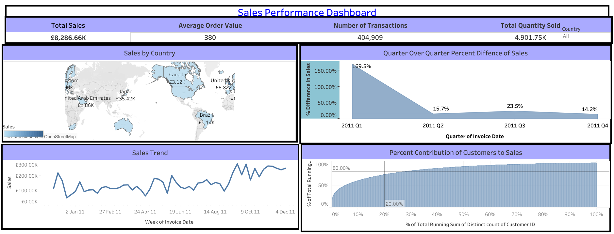
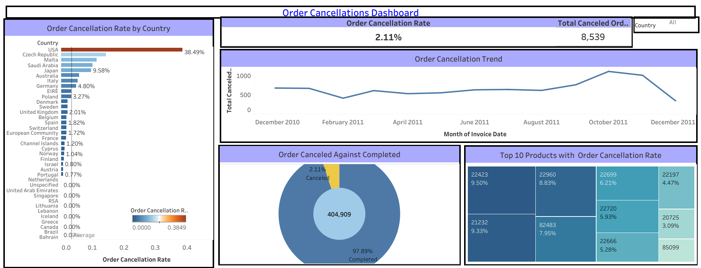

# Online-Retail-Project
 
## 1.0 Introduction

This case study focuses on analyzing e-commerce data from a UK-based online retailer that primarily sells unique all-occasion gifts to wholesalers. The dataset spans from December 2010 to December 2011, with records of transactions, cancellations, and customer demographics across various countries. This analysis addresses the company's key operational and sales challenges, such as understanding sales trends, cancellation patterns, and identifying the most valuable customers. Through data cleaning and exploration, insights were derived to understand customer purchasing behavior and improve business strategies. Assumptions include that all missing values in customer IDs were removed accurately, and that negative values in quantity and unit price were due to data entry errors are not actual transactions. The objectives are:

i.	To Analyze Factors Contributing to Order Cancellations Identify the key factors driving high cancellation rates, with a particular focus on customer demographics, specific products, and trends based on country. 

ii.	To Assess Customer Segmentation and Revenue Distribution Examine how sales contributions are distributed among different customer segments to explore opportunities for expanding the revenue base beyond the top customers. 

iii.	To Evaluate Sales Patterns and Seasonal Trends Analyze sales trends on a quarterly and monthly basis to aid in resource planning, particularly in anticipation of increased demand in Q4. 

iv.	To Investigate High-Cancellation Products and Identify Improvement Areas Review the products with the highest cancellation rates to uncover potential reasons behind these cancellations, allowing the retailer to enhance inventory management or marketing strategies for these items.

**_Disclaimer: This project was created using a dataset from DataCamp, designed to support learning and skill development. The insights and findings are meant to showcase analytical techniques._**

## 2.0 Business Problems

i.	Lack of Insight into Profitable Sales Periods and Key Customer Segments

•	The company is not fully aware of its peak sales periods or which customer segments are most valuable, making it challenging to optimize sales strategies and customer retention.

ii.	High Order Cancellation Rates Impacting Profitability

•	Certain countries and products have elevated cancellation rates, leading to revenue losses and increased operational costs due to restocking and refund processing.

iii.	Unclear Sales Distribution Across Regions

•	Without clarity on regional sales performance, the company struggles to make data-driven decisions on where to focus marketing efforts or adjust inventory for specific markets.

iv.	Frequent Cancellations of Specific Products

•	Certain products experience significantly higher cancellation rates, suggesting potential issues with inventory control, product quality, or customer satisfaction.

## 3.0 Data Overview, Transformation, and Key Metrics

**i. Data Overview**

The dataset encompasses orders from various countries placed between December 2010 and December 2011, primarily from wholesale customers. Initially, the raw dataset contained 541,909 rows and 8 columns, capturing details such as transaction numbers, product codes, quantities, and country of origin.

**ii. Data Transformation**

To ensure data quality and accuracy, a comprehensive data cleaning process was conducted in MS Excel while the metrics developed were performed in Tableau:

**iii.	Data Collection:** The dataset was imported from an external CSV file for analysis.

**iv.	Data Cleaning Steps:**

a.	Removed records with missing CustomerID values to ensure reliable customer insights.

b.	Addressed inconsistencies within the StockCode column.

c.	Eliminated negative values in UnitPrice and Quantity, ensuring all transaction values were positive.

d.	Formatted UnitPrice values to GBP currency for consistency.

Following these transformations, the dataset was reduced from 541,909 to 404,909 rows.

**v.	Key Metrics and Analysis**

Several critical metrics were developed to support further analysis, including:

•	Average Order Value

•	Order Cancellation Rate

•	Sales

•	Total Sales

•	Total Canceled Orders

•	Total Quantity Sold

vi.	Dashboard Development

## Explore the Dashboards

Dive into these interactive **Sales Performance** and **Order Cancellations Dashboards** to explore key insights.

### 1. Sales Performance Dashboard

### 2. Order Cancellations Dashboard

Two Tableau dashboards were created to visualize key findings:

**Sales Performance Dashboard:**

Highlights overall sales metrics and customer contributions. This includes a map of sales by country, line charts for sales trends, an area chart for quarterly growth, and a Pareto chart for customer sales contribution.

  

**Order Cancellations Dashboard:**

Provides insights into cancellation rates by date, product, and region. This features a line chart for cancellation trends, a donut chart for order completion versus cancellation, a tree map for product cancellation rates, and a bar chart for cancellations by country. 

   

## 4.0 Integrated Analysis and Findings (Insight-Driven)

**i. Insight into Profitable Sales Periods and Key Customer Segments**

•	Objective: Identify high-value customers and peak sales periods.

•	Analysis: Utilizing the Pareto Chart, the analysis demonstrated that 26.75% of customers contributed to 80% of total sales. The Sales Trend Line Chart tracked sales over time, revealing significant peaks on September 18 and October 2, 2011, particularly during Q4, which saw the highest sales activity.

•	Findings: This insight emphasizes the importance of focusing marketing efforts on high-value customers during peak sales periods, enabling the company to tailor promotions and enhance customer retention strategies effectively.

**ii. Order Cancellation Rates**

•	Objective: Assess trends contributing to order cancellations.

•	Analysis: The Order Cancellation Trend Line Chart illustrated daily fluctuations, highlighting peaks on October 20 and November 20. The Donut Chart revealed an order cancellation rate of 2.11%, indicating that while the majority of orders were completed, a significant number were canceled.

•	Findings: Understanding these cancellation trends allows the company to investigate potential operational issues or seasonal challenges. Targeted efforts to address these peaks could improve overall customer satisfaction and reduce cancellations.

**iii. Sales Distribution Analysis**

•	Objective: Evaluate sales performance across regions.

•	Analysis: The Sales by Country Map visualization identified the distribution of sales, pinpointing the United Kingdom, France, and Australia as the top markets contributing to the majority of sales.

•	Findings: This geographic insight supports focused marketing strategies and resource allocation in high-performing regions, enhancing revenue generation efforts.

**iv Product-Specific Cancellation Insights**

•	Objective: Investigate cancellation rates for specific products.

•	Analysis: The Product Cancellation Rates Tree Map highlighted that StockCodes 22423, 21232, and 22960 exhibited the highest cancellation rates. The Cancellation Rate by Country Bar Chart further identified the USA, Czech Republic, and Malta as having elevated cancellation rates.

•	Findings: These insights indicate potential issues with product quality or description accuracy. Addressing these challenges can lead to improved inventory management and reduced cancellation rates, ultimately enhancing customer satisfaction and loyalty.

## 6.0	Next Steps

**i.	Implement Targeted Marketing Campaigns**

Action: Develop and launch campaigns focused on the 26.75% of customers who generate the majority of sales.

Responsibility:	Marketing team, with insights from the data analytics team.

Timeline: Begin in the next quarter.

**ii.	Refine Inventory and Quality Control for High-Cancellation Products**

Action: Adjust inventory and establish quality assurance measures for products with high cancellation rates.

Responsibility: Operations and Quality Control teams.

Timeline: Review stock and implement changes within two months.

**iii.	Introduce Cancellation-Reduction Measures in High-Risk Regions**

Action: Research reasons for cancellations in the USA, Czech Republic, and other high-risk regions and develop strategies to reduce them.

Responsibility: Customer Service and International Strategy teams.

Timeline: Conduct research in the next quarter, with strategy implementation by the following quarter.

